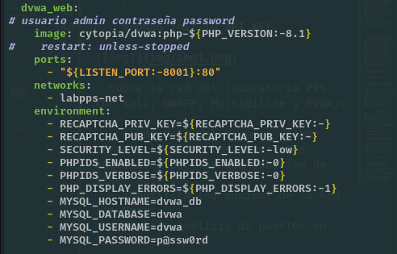
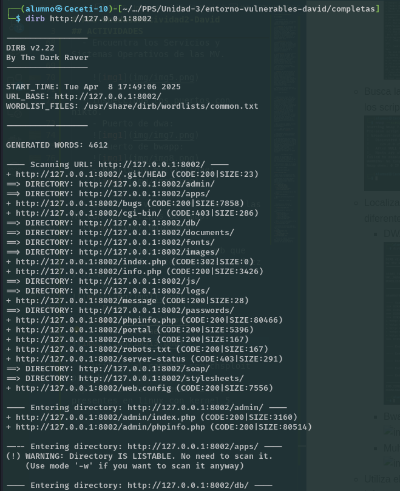

# PPS-Unidad3Actividad2-David

## ACTIVIDADES

- Busca información de:

  - Como podemos obtener información pública con protocolo whois, web DoaminTools y DSNrecon.

    - **WHOIS**: Es un protocolo que permite consultar bases de datos para obtener información sobre la propiedad y los datos de contacto de un dominio o dirección IP. Al realizar una consulta WHOIS, puedes descubrir detalles como el nombre del registrante, la organización, la dirección de correo electrónico, la fecha de creación y expiración del dominio, entre otros.

    - **DomainTools**: Es una plataforma en línea que ofrece servicios avanzados relacionados con dominios, incluyendo búsquedas WHOIS, historial de registros, monitoreo de dominios y análisis de relaciones entre dominios. Es útil para investigar la reputación de un dominio y su historial.

    - **DSrecon**: Es una herramienta de código abierto utilizada para recopilar información sobre los registros DNS de un dominio. Permite realizar transferencias de zona, enumerar subdominios, descubrir servidores de correo y otros registros DNS que pueden ser útiles en una evaluación de seguridad.

  - Cómo podemos utilizar Nmap y nikto, para buscar equipos, puertos abiertos, servicios, vulnerabilidades.
 
    **Nmap**: Es una herramienta de código abierto para el escaneo de redes y la auditoría de seguridad. Permite descubrir hosts activos en una red, identificar puertos abiertos, determinar servicios en ejecución y sus versiones, y detectar sistemas operativos. Además, Nmap cuenta con el Nmap Scripting Engine (NSE), que permite la ejecución de scripts para detectar vulnerabilidades específicas.

    Ejemplo: Un ejemplo simple de Nmap es escanear un host para ver qué puertos están abiertos:

        nmap 192.168.1.1

  - Cómo utilizar Wfuzz, Dirb para localizar recursos web en servidores.
    - **Wfuzz**: Es una herramienta diseñada para realizar pruebas de fuerza bruta en aplicaciones web, permitiendo descubrir recursos ocultos como archivos, directorios y parámetros. Es altamente configurable y soporta el uso de diccionarios personalizados para adaptarse a diferentes escenarios de prueba.
    - **Dirb**: Es un escáner de contenido web que utiliza listas predefinidas de nombres de directorios y archivos para detectar recursos ocultos en un servidor web. Dirb es útil para descubrir páginas de administración, scripts de respaldo y otros archivos que no están enlazados directamente en el sitio web.

  - Qué scripts que podemos utilizar con Nmap para la búsqueda de vulnerabilidades.

          nmap -sV --script http-vuln-cve2013-0156 <objetivo>

  - Cómo podemos buscar información de explotación de vulnerabilidades con searchsploit.

    Es una herramienta que permite buscar y acceder a exploits y pruebas de concepto disponibles en la base de datos de Exploit-DB desde la línea de comandos. Es especialmente útil para investigadores y profesionales de la seguridad que necesitan encontrar rápidamente exploits para vulnerabilidades específicas. Por ejemplo, para buscar exploits relacionados con "Apache", se puede utilizar:

            searchsploit apache

- Instala en tu navegador la extensión de Shodan y muestra la información que tenemos tanto de ip, como de dominio del sitio http://iesvalledeljerteplasencia.es

    Para instalar shodan en el equipo Linux sería con el siguiente comando:

    pip install shodan

    shodan init TU_API_KEY

- Sobre la red del laboratorio PPS con kali, bWAPP, Multidillae y DVWA:

  - Ayudándote del fichero docker-compose localiza las diferentes máquinas y puertos que deberían de tener abiertos.
    - Puerto dwa:

     - Puerto de bwapp: 
  
    - Puerto de multillidae:   
    

  - Identifica los equipos de la Red con Nmap.
  

  - Realiza análisis de puertos en las MV.
  
         nmap -sV 0.0.0.0 -p-

  - Encuentra los Servicios y Sistemas Operativos de las MV.
  
    

  - Inspecciona los puertos con nikto.
    - Puerto de dwa:
    
    - Puerto de bwapp:
    
    - Puerto de multillidae: 
    

  - Busca las vulnerabilidades de las MV con los scripts de Nmap.
  

  - Localiza los servicios web que tienen las diferentes máquinas (Wfuzz y Dirb).
    - DWA:

    - Bwapp:
  
    - Multillidae:

  - Utiliza el comando searchsploit para buscar información de explotación de vulnerabilidades presentes en linux con kernel 5.
